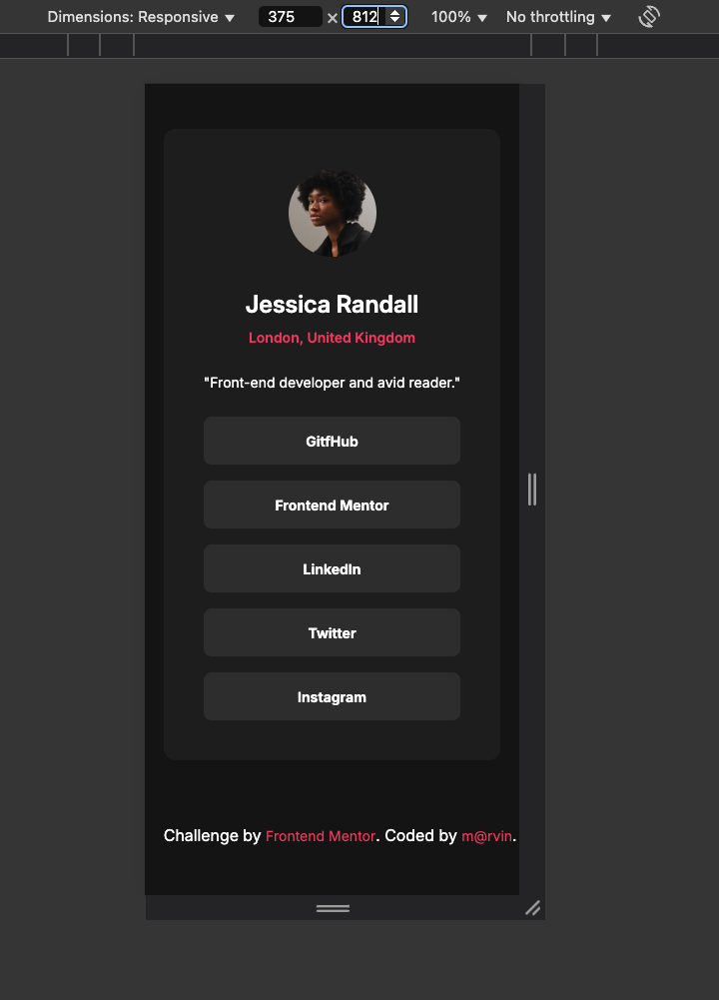

📌 Overview

This repository contains a CSS style guide designed for a modern, minimalistic user interface. It features a dark theme, flexible typography, and consistent spacing using CSS variables.

📸 Screenshot

🔹 

🖌️ Features

✔ Dark theme color palette with primary and accent colors
✔ Custom typography with predefined font sizes and weights
✔ Spacing variables for consistent padding and margins
✔ Responsive layout for different screen sizes
✔ Reusable components for easy customization

🎨 Color Palette

The design system includes a set of predefined colors for background, text, and UI elements:

Primary: Dark background for the main layout
Secondary: Slightly lighter background for containers
Accent: Highlight color for interactive elements
Neutral: Text and button colors for readability

🔡 Typography

The guide uses a modern, clean font with a well-balanced hierarchy:

Font Family: Inter
Font Sizes: Includes large, medium, and small text sizes
Font Weights: Supports bold, semi-bold, and regular styles
Line Height: Optimized for readability

📏 Spacing System

A spacing scale is used to ensure consistent padding and margin throughout the layout. It includes small, medium, and large spacing values.

🖼️ Layout & Components

Container: A centered card-like structure with rounded corners
Avatar & User Details: Circular profile images with text alignment
Button: Styled with background color, border-radius, and hover effects
Footer: Fixed at the bottom for attribution and extra info
